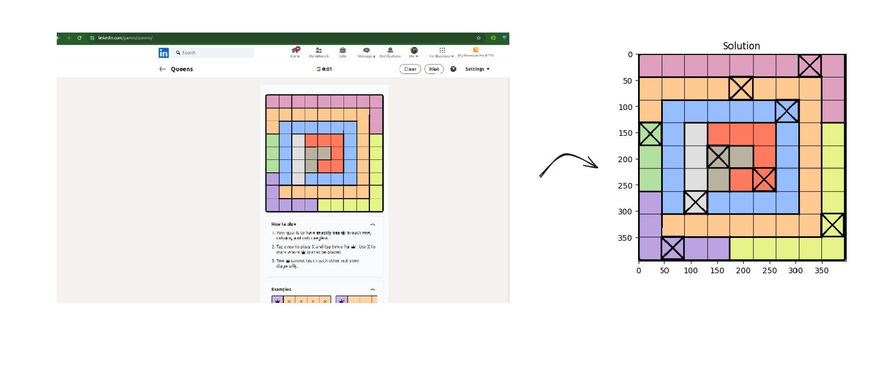

# Rule of the queen(linkedin version) game:
- One queen in each row
- One queen in each column
- One queen in each color region
- No two queens can touch by corners

# How to solve:
- Capture a screenshot of the board (better if empty)
- Run the jupyter notebook with the modified image path
- See the soltion at the end of the notebook
- Star the repo if you like it

# Setup:
- Create virtual environment: `python -m venv venv`
- Activate virtual environment: `source venv/bin/activate`
- Install requirements: `pip install -r requirements.txt`
- Run the jupyter notebook: `jupyter lab`

# Example:
